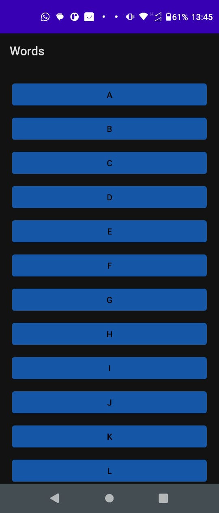

  

    
 <b># Projeto Words<b>
  

      

    
🔧<b>Funcionalidade</b>: projeto com o objetico de usar uma recycler view para exibir em ordem alfabetica titulos de jogos listados dentro de uma array 
em que sua função sera redirecionar ao clicar no titula para uma busca ao google do mesmo 

📰<b>Informações</b>:   projeto realizado em sala de aula, aplicando funções e a RecyclerView. Kotlin - Android Studio - 24/05/23

📈<b>Projeto</b>:   Finalizado

